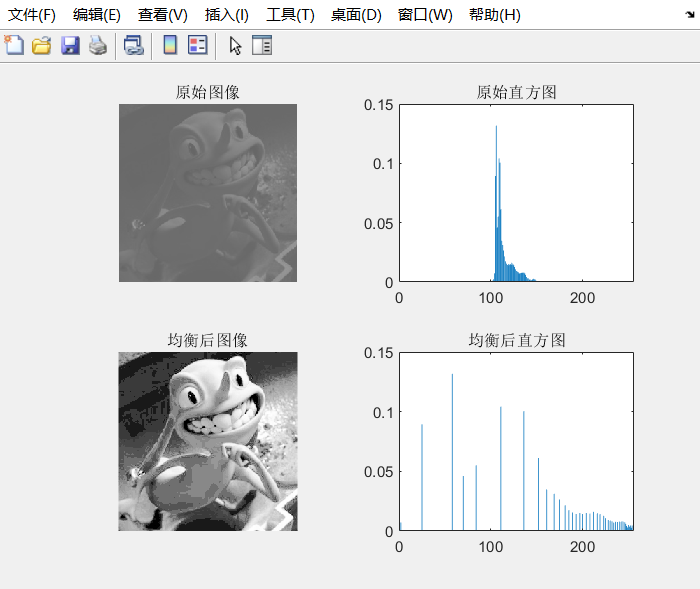
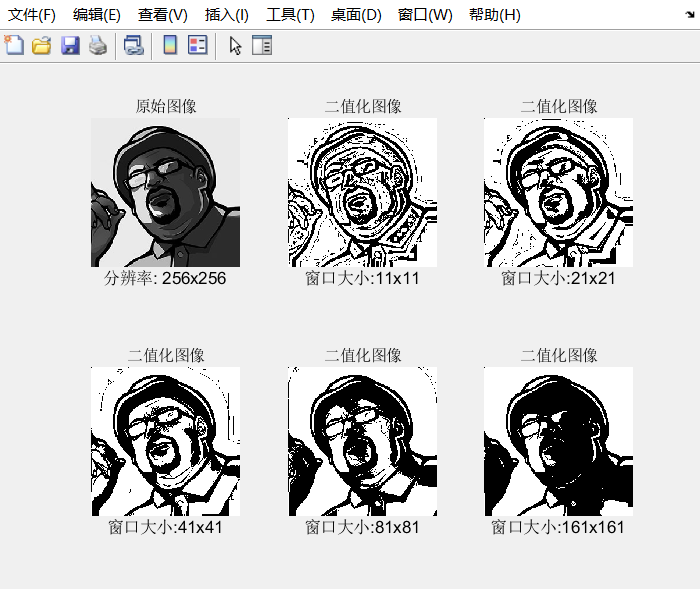

# FPGA-Homework
直方图均衡化 自适应阈值二值化 自动仿真

## 文件说明
vfiles中存放了直方图均衡化和自适应阈值二值化的verilog原文件和仿真文件  
imgs中存放了测试图形  
txtdata中存放了转换的文本文件  
lxtwave中存放了仿真波形文件  

matlab文件实现的是文本文件和图片的转换  

仿真测试使用了iverilog,把iverilog解压后放在根目录,运行相应脚本即可仿真

## 效果
直方图均衡化  
	  

自适应阈值二值化  
	
